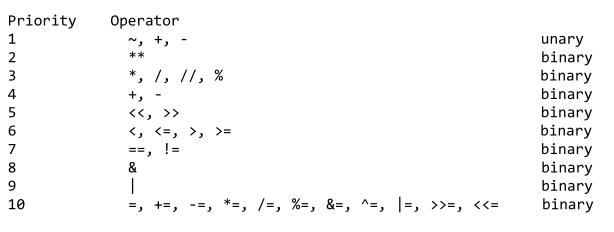

# Python Practice

- [x] print
  - [x] end
  - [x] sep
- [x] literals
- [x] datatypes
  - [x] int     
  - [x] float
  - [x] str
    - [x] string formatting (string interpolation)
      - [x] "%s" % (var, )
      - [x] "{}".format(var,)
      - [x] f"{var}"
  - [x] bool
  - [ ] list
    - [x] operations/ methods
    - [x] indexing
    - [x] slicing
    - [x] 2-d lists
      - [x] jagged matrix
      - [x] flatten a matrix
  - [ ] dict
  - [ ] tuple
  - [ ] set
- [x] operators
  - [x] int, float, str, bool
  - [x] precedence
  - [x] shortcuts
  - [x] bitwise
    - [x] and (&)
    - [x] or (|)
    - [x] negation (~)
    - [x] xor (^)
    - [x] shift (left, right)
- [x] variables
- [x] comments
- [x] input()
- [x] useful inbuilt functions
  - [x] min
  - [x] max
  - [x] abs
  - [x] len
  - [x] range
  - [x] map
  - [x] filter
  - [x] exit
- [x] useful keywords
  - [x] and
  - [x] or
  - [x] not
  - [x] in
- [x] conditions
  - [x] if-elif-else
- [x] loops
  - [x] while
    - [x] while-else
  - [x] for(-each)
    - [x] for(-each)-else
    - [x] list comprehension/ inline for
    - [x] enumerate
  - [x] break
  - [x] continue
- [ ] functions
  - [x] defining and calling
  - [x] args
    - [x] simple
    - [x] default
    - [x] variable args
    - [x] variable keyword args
  - [x] scope
  - [x] global
  - [ ] call by value/ call by reference
  - [ ] lambda

last page: 253 / 590

## Common Notes

 - [] -> list, index, keys, slicing
 - () -> function, tuples
 - {} -> dict, string interpolation
---
 - Mutable datatypes (editable) -> list, dict
 - Immutable datatypes (non-editable) -> tuple, str
---
 - function : piece of code which can be reused; ex: func(value)
 - method   : same as function, but is a part of class; ex: obj.method(value)
---
 - **declare** : function without body, informing compiler about existence of function
 - **define** : function with body, actual implementation and logic
 - **function call** : calling the function to do the specific task.

